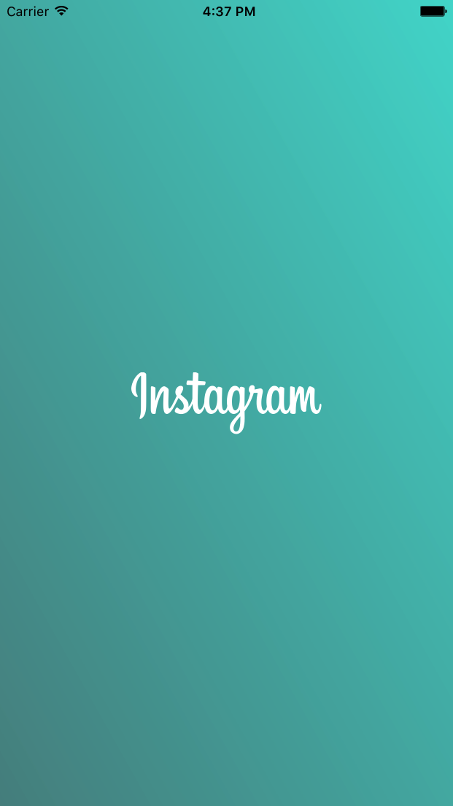

# Pastel(This Project is an Objective-C version of [Pastel](https://github.com/cruisediary/Pastel))
Instagram like Gradient background animation





## Example

```objc
- (void)viewDidLoad {
    [super viewDidLoad];
    
    CYPastelView *pastelView = [[CYPastelView alloc] initWithFrame:self.view.bounds];
    pastelView.animationDuration = 3.0;
    [pastelView startAnimation];
    [self.view insertSubview:pastelView atIndex:0];
}
```

## License

Pastel is available under the MIT license. See the LICENSE file for more info.
